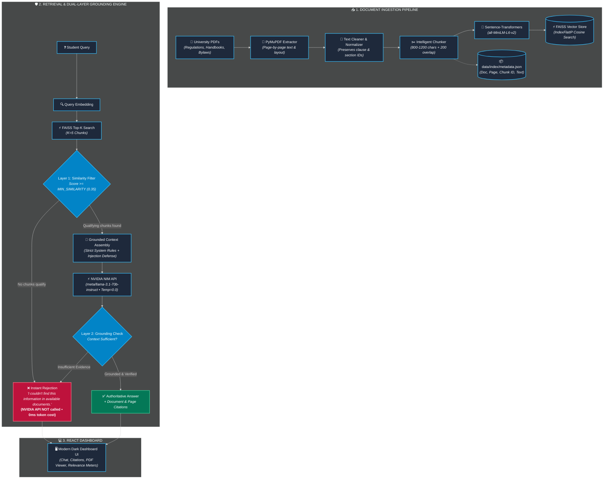

<div align="center">

<!-- Animated Header Banner -->


<!-- Typing SVG Animation -->
<a href="https://unirag-assistant-5769.netlify.app">
  
</a>

<br/>

<!-- Status & Tech Badges -->
<p align="center">
  <a href="https://unirag-assistant-5769.netlify.app">
    
  </a>
  <a href="https://build.nvidia.com/">
    
  </a>
  <a href="https://fastapi.tiangolo.com/">
    
  </a>
  <a href="https://react.dev/">
    
  </a>
  
  
</p>

<!-- Quick Action Buttons -->
<p align="center">
  <a href="#-quick-start"><b>⚡ Quick Start</b></a> •
  <a href="#-system-architecture"><b>🏛️ Architecture</b></a> •
  <a href="#-dual-layer-grounding-defense"><b>🛡️ Zero-Hallucination</b></a> •
  <a href="#-api-reference"><b>📡 API Reference</b></a> •
  <a href="#-troubleshooting"><b>🔧 Troubleshooting</b></a>
</p>


</div>

<br/>

## 🌟 Overview

The **University Regulation RAG Assistant** is a production-engineered Retrieval-Augmented Generation system purpose-built for higher education institutions. It empowers students, faculty, and administrative staff to query dense, complex academic policies and obtain instant, strictly grounded answers backed by **exact document and page-level citations**.

### 💎 Why This Exists
Standard AI chatbots hallucinate policies, speculate on credit rules, or blend conflicting regulations from different academic years. **This assistant is engineered to never guess.** If a regulation is not explicitly stated in the ingested university documents, the engine refuses to speculate and transparently alerts the user.

```
┌──────────────────────────────────────────────────────────────────────────────────┐
│ 🎓 "What is the minimum attendance requirement for semester examinations?"      │
├──────────────────────────────────────────────────────────────────────────────────┤
│ 💬 "According to the Attendance Policy, every student must maintain a minimum   │
│     attendance of 75% in each registered course to be eligible to appear for     │
│     the end-semester examinations [Attendance_Policy.pdf, Page 1]."             │
│                                                                                  │
│ 📑 Citations:                                                                    │
│    └── Attendance_Policy.pdf (Page 1) • Similarity: 88.5% • [View Source (p. 1)] │
└──────────────────────────────────────────────────────────────────────────────────┘
```

---

## ✨ Key Features

<table>
  <tr>
    <td width="50%">
      <h3>🛡️ Dual-Layer Grounding</h3>
      <p>Multi-stage defense prevents hallucinations. <b>Layer 1</b> rejects out-of-domain queries at the vector retriever stage (saving 100% of LLM cost and latency). <b>Layer 2</b> enforces strict context bounds via system prompts.</p>
    </td>
    <td width="50%">
      <h3>📑 Page-Precise Citations</h3>
      <p>Every response references the exact <b>Source PDF Name</b> and <b>Page Number</b>. Built-in direct deep-linking allows users to click <code>[View Source (Page X)]</code> and view the original PDF opened at that exact page.</p>
    </td>
  </tr>
  <tr>
    <td width="50%">
      <h3>⚡ NVIDIA NIM High-Performance LLM</h3>
      <p>Powered by <b>meta/llama-3.1-70b-instruct</b> via NVIDIA NIM API. Uses deterministic sampling (<code>temperature=0.0</code>) for consistent, authoritative academic interpretations.</p>
    </td>
    <td width="50%">
      <h3>🔍 Intelligent Chunker & FAISS</h3>
      <p>Semantic chunking (800–1200 chars, 200 overlap) that respects section headings, clause numbering, and sub-clauses. Stored in high-speed <b>FAISS IndexFlatIP</b> with cosine similarity.</p>
    </td>
  </tr>
  <tr>
    <td width="50%">
      <h3>🎨 Modern Dark Dashboard</h3>
      <p>Polished React 18 interface featuring glassmorphic sidebar, live system health pills, drag-and-drop PDF uploader, source cards with relevance meters, and one-click sample queries.</p>
    </td>
    <td width="50%">
      <h3>🚀 1-Click Sample Regulations</h3>
      <p>Hit <b>"⚡ Load Sample Regulations"</b> to automatically generate 4 realistic university PDFs (Attendance, Examinations, Academic 2026, Conduct) and index them in seconds.</p>
    </td>
  </tr>
</table>

---

## 🏛️ System Architecture



---

## 🛡️ Dual-Layer Grounding Defense

To ensure that university policies are never misquoted or fabricated, this assistant implements a strict **Dual-Layer Defense Mechanism**:

```
                              ┌─────────────────────────┐
                              │     Student Question    │
                              └────────────┬────────────┘
                                           │
                                           ▼
                       ┌───────────────────────────────────────┐
                       │  Layer 1: Vector Similarity Filter   │
                       │     (Threshold: MIN_SIMILARITY >= 0.35)│
                       └───────────────────┬───────────────────┘
                                           │
                   ┌───────────────────────┴───────────────────────┐
                   ▼                                               ▼
     [ Scores < 0.35: Out of Domain ]               [ Scores >= 0.35: Policy Match ]
                   │                                               │
     🚫 Immediate Rejection                         📝 Strict Grounded Prompt Assembly
     • "Information not found"                      • Untrusted context boundary tags
     • NVIDIA API NOT invoked                       • Negative constraint enforcement
     • 0 latency • 0 token cost                     • Injection attack prevention
                                                                   │
                                                                   ▼
                                                    ┌───────────────────────────────┐
                                                    │ Layer 2: LLM Verification     │
                                                    │   (Deterministic Temp = 0.0)  │
                                                    └──────────────┬────────────────┘
                                                                   │
                                                   ┌───────────────┴───────────────┐
                                                   ▼                               ▼
                                          [ Unproven Claim ]              [ Verified Grounded ]
                                                   │                               │
                                          🚫 Rejection Message            ✅ Answer + Citations
```

| Defense Layer | Mechanism | Purpose | Latency Impact | Token Cost |
| :--- | :--- | :--- | :---: | :---: |
| **Layer 1: Threshold** | FAISS Cosine Score Filtering (`>= 0.35`) | Filters out nonsensical or unindexed topics | **< 15ms** | **$0.00** |
| **Layer 2: Prompt Enclosure** | Isolated XML Context Blocks + Strict Rejection Directives | Eliminates hallucination on partial/ambiguous data | Normal | Optimal |

---

## 🧰 Tech Stack

<div align="center">

| Domain | Technologies & Libraries |
| :--- | :--- |
| **AI / LLM Engine** |   |
| **Embeddings & Vector Store** |   |
| **Document Processing** |   |
| **Backend Framework** |    |
| **Frontend Framework** |    |
| **Deployment** |   |

</div>

---

## 📂 Project Directory Structure

```plaintext
university-rag/
├── 📁 backend/
│   ├── 🐍 main.py                      # FastAPI application, lifespan & CORS
│   ├── ⚙️ config.py                    # Centralized settings & path configuration
│   ├── 📋 requirements.txt             # Backend Python dependencies
│   ├── 🔒 .env.example                 # Environment variable template
│   ├── 📁 api/
│   │   ├── 💬 chat.py                  # POST /chat endpoint with validation
│   │   └── 📄 documents.py             # Upload, delete, stream, rebuild, status
│   ├── 📁 ingestion/
│   │   ├── 📑 pdf_loader.py            # PyMuPDF extractor & scanned document detector
│   │   ├── 🧹 cleaner.py               # Text normalizer preserving section numbering
│   │   └── ✂️ chunker.py               # Semantic chunker with metadata tracking
│   ├── 📁 embeddings/
│   │   └── 🧠 model.py                 # Singleton SentenceTransformer service
│   ├── 📁 vectorstore/
│   │   └── ⚡ faiss_store.py           # FAISS IndexFlatIP & JSON metadata store
│   ├── 📁 rag/
│   │   ├── 🔍 retriever.py             # Similarity search & threshold filtering
│   │   ├── 📝 prompt.py                # Grounded prompt & injection defense
│   │   └── 🔄 pipeline.py              # End-to-end RAG workflow & dual-layer engine
│   ├── 📁 llm/
│   │   └── 🤖 nvidia_client.py         # Dedicated NVIDIA NIM OpenAI-compatible client
│   ├── 📁 utils/
│   │   └── 📊 logging_config.py        # Structured colored application logging
│   └── 📁 tests/
│       └── 🧪 test_rag.py              # Automated test suite (Chunking, FAISS, Grounding)
│
├── 📁 frontend/
│   ├── 📦 package.json                 # React & Vite dependencies
│   ├── ⚡ vite.config.js               # Vite build config & backend proxy
│   ├── 🌐 index.html                   # HTML5 entry with modern typography
│   └── 📁 src/
│       ├── 🚀 main.jsx                 # React root mount
│       ├── 💻 App.jsx                  # Main dashboard controller
│       ├── 🎨 App.css                  # Dark glassmorphic styling & micro-animations
│       ├── 🔌 api.js                   # Axios/Fetch API client
│       └── 📁 components/
│           ├── 🧭 Header.jsx           # System health & status chips
│           ├── 📂 Sidebar.jsx          # Document manager & FAISS index controls
│           ├── 📤 DocumentUpload.jsx   # Drag-and-drop multiple PDF uploader
│           ├── 📋 DocumentList.jsx     # Uploaded PDF registry & viewer links
│           ├── 💬 Chat.jsx             # Conversational interface with auto-scroll
│           ├── 🗨️ ChatMessage.jsx      # Formatted answer bubbles & source cards
│           ├── 📑 SourceCard.jsx       # Relevance score meters & deep-link citations
│           └── 💡 EmptyState.jsx       # Welcome hero with clickable sample queries
│
├── 📁 data/
│   ├── 📁 documents/                   # Uploaded PDF storage directory
│   └── 📁 index/                       # Persisted FAISS vector index & metadata
├── 📁 scripts/
│   └── 🛠️ generate_sample_regulations.py # Generates 4 authentic university PDFs
├── 📁 sample_data/                     # Pre-generated sample regulation PDFs
├── 🚀 start.bat                        # Automated 1-click Windows startup script
├── 🌐 netlify.toml                     # Netlify SPA routing & build configuration
└── 📖 README.md                        # Documentation
```

---

## ⚡ Quick Start

### 📋 Prerequisites
- **Python**: `3.11+`
- **Node.js**: `18.x` or `20.x` & `npm`
- **NVIDIA API Key**: Free key with 1,000+ complimentary credits available at [build.nvidia.com](https://build.nvidia.com/)

---

### 🚀 Option A: 1-Click Windows Launcher (Recommended)

Simply double-click `start.bat` in the project root:

```cmd
start.bat
```

> **What this script does:**
> 1. ✅ Verifies Python and Node.js environments.
> 2. 🐍 Spawns FastAPI backend server on `http://localhost:8000`.
> 3. ⚛️ Spawns Vite React frontend server on `http://localhost:5173`.
> 4. 🌐 Automatically opens your default browser to the live interface.

---

### 🛠️ Option B: Manual Setup

<details>
<summary><b>👉 Step 1: Configure Environment Variables</b></summary>

1. In the `backend/` directory, copy `.env.example` to `.env`:
   ```bash
   copy backend\.env.example backend\.env
   ```
2. Open `backend/.env` and insert your NVIDIA API key:
   ```env
   # NVIDIA NIM API Configuration
   NVIDIA_API_KEY=nvapi-your-actual-api-key-here
   NVIDIA_BASE_URL=https://integrate.api.nvidia.com/v1
   NVIDIA_MODEL=meta/llama-3.1-70b-instruct

   # RAG & Retrieval Tuning
   EMBEDDING_MODEL_NAME=sentence-transformers/all-MiniLM-L6-v2
   TOP_K=5
   MIN_SIMILARITY=0.35
   CHUNK_SIZE=1000
   CHUNK_OVERLAP=200
   ```
   > [!IMPORTANT]
   > The `NVIDIA_API_KEY` is loaded exclusively on the backend server and is **never** exposed to the React frontend or client browsers.

</details>

<details>
<summary><b>👉 Step 2: Start the FastAPI Backend</b></summary>

```bash
# Navigate to project root
cd "University Regulation RAG Assistant"

# Install backend dependencies
pip install -r backend/requirements.txt

# Start FastAPI server with live reload
uvicorn backend.main:app --host 0.0.0.0 --port 8000 --reload
```
Interactive Swagger API documentation will be available at: [http://localhost:8000/docs](http://localhost:8000/docs)

</details>

<details>
<summary><b>👉 Step 3: Start the Vite React Frontend</b></summary>

```bash
# In a new terminal, navigate to frontend/
cd frontend

# Install Node dependencies
npm install

# Start Vite development server
npm run dev
```
Open [http://localhost:5173](http://localhost:5173) in your browser.

</details>

---

## 📖 Walkthrough & Usage Guide

### 1️⃣ Populate Regulation Documents
* **Method 1 (Instant Sample Data)**: In the sidebar, click **⚡ Load Sample Regulations**. This automatically creates 4 official-style university PDFs (`Attendance_Policy.pdf`, `Examination_Rules.pdf`, `Academic_Regulations_2026.pdf`, `Student_Code_of_Conduct.pdf`) and indexes them instantly.
* **Method 2 (Upload Custom PDFs)**: Drag and drop your institution's PDF files into the upload box in the sidebar and click **Upload Files**.

### 2️⃣ Rebuild the Vector Index
* When you add or remove documents, click **Rebuild FAISS Index**.
* Watch the status pill transition from `INDEXING...` to `● READY` along with the exact count of indexed text chunks.

### 3️⃣ Ask Policy Questions
Type your question in the chat bar or click one of the suggested sample questions:
* *"What is the minimum attendance requirement for semester examinations?"*
* *"Can an attendance shortage between 65% and 75% be condoned?"*
* *"What is the punishment for possessing unauthorized materials in an examination?"*
* *"What are the criteria for awarding an Honours degree?"*
* *"What is the university's policy on colonizing Mars?"* *(Demonstrates Layer 1 instant zero-hallucination rejection)*

### 4️⃣ Inspect Authoritative Citations
* Each grounded answer includes interactive **Source Cards** displaying the document name, page number, semantic similarity meter (%), and text excerpt.
* Click **`[View Source (Page X)]`** to open the exact page in your browser's PDF reader.

---

## 📡 API Reference

<div align="center">

| Method | Endpoint | Description | Payload / Params |
| :---: | :--- | :--- | :--- |
| `GET` | `/health` | System health, NVIDIA configuration & index stats | *None* |
| `GET` | `/documents` | List stored PDF files with sizes and indexing flags | *None* |
| `POST` | `/documents/upload` | Upload one or more PDF files | `multipart/form-data` |
| `DELETE`| `/documents/{filename}` | Delete a stored PDF file and metadata | `filename: string` |
| `GET` | `/documents/{filename}` | Stream PDF to browser (`#page=X` compatible) | `filename: string` |
| `POST` | `/index/rebuild` | Extract, chunk, embed & build FAISS vector index | *None* |
| `GET` | `/index/status` | Current indexing status (`ready`/`indexing`) & counts | *None* |
| `POST` | `/chat` | Submit question, execute RAG pipeline, get citation response | `{"question": "..."}` |
| `POST` | `/load-sample-data` | Generate sample regulation PDFs & rebuild index | *None* |

</div>

<details>
<summary><b>🔍 View Example Chat Request & Response Payload</b></summary>

#### Request
```bash
curl -X POST http://localhost:8000/chat \
  -H "Content-Type: application/json" \
  -d '{"question": "What is the minimum attendance requirement?"}'
```

#### Grounded Response (`found: true`)
```json
{
  "answer": "According to the Attendance Policy, every student must maintain a minimum attendance of 75% in each registered theory and laboratory course in order to be eligible to appear for the end-semester examinations [Attendance_Policy.pdf, Page 1].",
  "found": true,
  "sources": [
    {
      "document": "Attendance_Policy.pdf",
      "page": 1,
      "score": 0.8845,
      "text": "2. Minimum Attendance Requirement\n2.1 Every student must maintain a minimum attendance of 75% in each registered theory and laboratory course in order to be eligible to appear for the end-semester examinations."
    }
  ],
  "error": null
}
```

#### Rejected Response (`found: false` — Out of Domain)
```json
{
  "answer": "I couldn't find this information in the available university documents.",
  "found": false,
  "sources": [],
  "error": null
}
```

</details>

---

## 🧪 Automated Testing

The backend includes a comprehensive unit testing suite:

```bash
python -m unittest backend/tests/test_rag.py -v
```

```plaintext
test_chunk_metadata_preservation (backend.tests.test_rag.TestRAGPipeline) ... ok
test_faiss_vector_store_indexing_and_search (backend.tests.test_rag.TestRAGPipeline) ... ok
test_grounding_prompt_construction (backend.tests.test_rag.TestRAGPipeline) ... ok
test_layer1_not_found_defense (backend.tests.test_rag.TestRAGPipeline) ... ok
test_nvidia_client_configuration (backend.tests.test_rag.TestRAGPipeline) ... ok
test_text_cleaner_preserves_clauses (backend.tests.test_rag.TestRAGPipeline) ... ok

----------------------------------------------------------------------
Ran 6 tests in 1.428s

OK
```

---

## 🔧 Troubleshooting

<details>
<summary><b>⚠️ NVIDIA_API_KEY is missing or unconfigured</b></summary>

* **Symptom**: Chat answers fail with an error stating NVIDIA API key is missing.
* **Fix**: Open `backend/.env` and replace `YOUR_NVIDIA_API_KEY` with your valid API key from [NVIDIA Build](https://build.nvidia.com/). Restart the backend server.

</details>

<details>
<summary><b>⚠️ No index currently loaded / 0 Chunks Indexed</b></summary>

* **Symptom**: Search returns "No index currently loaded" or no results for known questions.
* **Fix**: Click **⚡ Load Sample Regulations** or upload your PDFs and click **Rebuild FAISS Index** in the sidebar.

</details>

<details>
<summary><b>⚠️ Document has scanned / image-only pages</b></summary>

* **Symptom**: PDF text extraction produces empty strings or reports `text_extraction_failed`.
* **Fix**: The system uses digital text extraction via PyMuPDF. Scanned bitmap PDFs require OCR preprocessing (e.g., Tesseract or Adobe Acrobat OCR) prior to ingestion.

</details>

<details>
<summary><b>⚠️ Port 8000 or 5173 already in use</b></summary>

* **Symptom**: `ERROR: [Errno 10048] error while attempting to bind on address ('0.0.0.0', 8000)`
* **Fix**: Kill the existing process using the port, or edit `backend/main.py` (for port 8000) and `frontend/vite.config.js` (for port 5173).

</details>

---

<div align="center">

<!-- Animated Waving Footer -->


<p align="center">
  <b>University Regulation RAG Assistant</b> • Built with ❤️ for Higher Education Institutions
</p>

<p align="center">
  <a href="https://unirag-assistant-5769.netlify.app">🌐 Live Deployment</a> • 
  <a href="https://github.com">⭐ Star on GitHub</a>
</p>

</div>
